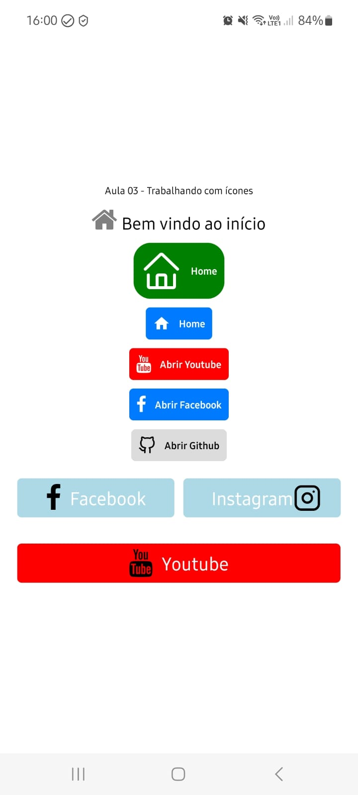

# Aula 03  
## Trabalhando com ícones  

- O uso das chaves no import indica que estamos importando funções de determinado arquivo;  
- Já quando estamos utilizando imports sem o uso de {} é quando queremos exportar e importar o módulo daquele arquivo;  
- As bibliotecas que utilizaremos possuem ícones no formato SVG, tamanho bem pequeno para aplicações mobile

### Passo 01:  
- Criar uma pasta com nome de **aula03**, em seguida criar um novo projeto com o nome appAula03

``` bash

npx create-expo-app appAula03

```

### Passo 02: Realizar os imports no arquivo App.js 

``` Javascript

import { AntDesign } from '@expo/vector-icons/'
import FontAwesome from '@expo/vector-icons/FontAwesome'

```

### Passo 03: Alterar a estrutura padrão 

``` Javascript

export default function App() {
  return (
    <SafeAreaView style={[styles.androidSafeArea, styles.container]}>
      <Text>Aula 03 - Trabalhando com ícones</Text>
      <StatusBar style="auto" />
    </SafeAreaView>
  );
}

```

### Passo 04: Criar os seguintes arquivos de estilo 

``` Javascript

 androidSafeArea: {
    paddingTop: Platform.OS === 'android' ? 35 : 0,
  },
  container: {
    flex: 1,
    backgroundColor: '#fff',
    alignItems: 'center',
    justifyContent: 'center',
    gap: 10,
    padding: 10
  },
  container2: {
    // flex: 1,
    display: 'flex',
    backgroundColor: '#fff',
    alignItems: 'center',
    justifyContent: 'space-between',

    gap: 10,
    padding: 10
  },
  alinharHorizontal: {
    flexDirection: 'row',
    alignItems: 'center',
    gap: 5
  },
  botao: {
    width: '100%',
  },
  btnSocialMedia: {
    // Caso opte pelo auto, os botões devem ter o tamanho de acordo com os componentes(texto, ícone)
    flexBasis: '100%',
    flexShrink: 1,
    flexDirection: 'row',
    alignItems: 'center',
    justifyContent: 'center',
    padding: 5,
    borderRadius: 5,

    height: 45,

  },
  vermelho: {
    backgroundColor: '#FF0000',
  },
  azulClaro: {
    backgroundColor: '#ADD8E6',
  },
  btnText: {
    paddingLeft: 10,
    fontSize: 26,
    color: 'white'
  }

```

### Passo 05: Criar os seguintes elementos e visualizar as alterações no smartphone 

``` Javascript


    {/* Ícone exibido em uma View com texto */}
    <View style={styles.alinharHorizontal}>
        <FontAwesome name='home' size={32} color='gray'></FontAwesome>
        <Text style={{ fontSize: 24 }}>Bem vindo ao início</Text>
    </View>

    {/* Ícone e botão criado com a biblioteca padrão*/}
    <AntDesign.Button name='home' size={48} backgroundColor='green' borderRadius={20} onPress={() => Alert.alert('Você clicou no Antdesign Button')}>
        Home
    </AntDesign.Button>

    {/* Ícone e botão criado com a biblioteca FontAwesome*/}
    <FontAwesome.Button name='home' onPress={() => Alert.alert('Você clicou no Awesome Button')}>
        Home
    </FontAwesome.Button>

    {/* Ícone e botão criado com a biblioteca FontAwesome com link para abrir o Youtuben neste exemplo foi inserido um alert perguntando ao usuário*/}
    <FontAwesome.Button name='youtube' backgroundColor='red' onPress={() => Alert.alert('Link externo', 'Deseja abrir http://youtube.com?',
    [
        {
        text: 'Cancelar',
        },
        {
        text: 'Acessar',
        onPress: () => Linking.openURL('http://youtube.com')
        }
    ]
    )}>
    Abrir Youtube
    </FontAwesome.Button>

    {/* Ícone e botão criado com a biblioteca FontAwesome com link para abrir o Facebook*/}
    <FontAwesome.Button name='facebook' onPress={() => Linking.openURL('http://facebook.com')}>
    Abrir Facebook
    </FontAwesome.Button>

    {/* Ícone e botão criado com a biblioteca Feather com link para abrir o Github*/}
    <Feather.Button name='github' color='black' backgroundColor='gainsboro' onPress={() => Linking.openURL('https://github.com/izaiasmaia?tab=repositories')}>
    Abrir Github
    </Feather.Button>

    
    {/* Alinhando botão em linha ocupando o espaço disponível*/}
    <View style={[styles.alinharHorizontal, styles.container2]}>
    {/* Botão criado com TouchableOpacity */}
    <TouchableOpacity style={styles.btnSocialMedia}>
        <FontAwesome name='facebook' size={32}></FontAwesome>
        <Text style={styles.btnText}>Facebook</Text>
    </TouchableOpacity>

    {/* Botão criado com TouchableOpacity */}
    <TouchableOpacity style={styles.btnSocialMedia}>
        <Text style={styles.btnText}>Instagram</Text>
        <Feather name='instagram' size={32}></Feather>
    </TouchableOpacity>
    </View>

    {/* Botão ocupando 100% da tela*/}
      <View style={[styles.alinharHorizontal, styles.container2]}>
        {/* Botão criado com TouchableOpacity */}
        <TouchableOpacity style={[styles.btnSocialMedia, styles.vermelho]}>
          <FontAwesome name='youtube' size={32}></FontAwesome>
          <Text style={styles.btnText}>Youtube</Text>
        </TouchableOpacity>
      </View>

```

### Imagem final da atividade:

  