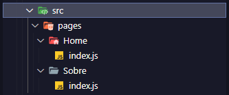

# Aula 04
## Trabalhando com Navegação

- React Navigation é uma das soluções existentes mais famosas e recomendadas pelo Facebook para roteamento e navegação entre telas no React Native. A famosa biblioteca Javascript, React Native, não apresenta mecanismos de navegação de forma nativa. Por isso, para executar essas ações da melhor forma possível, surgiu a biblioteca React Navigation.

### Docs React Navigation

- [React Navigation](https://reactnavigation.org/docs/getting-started/) - 

### Passo 01:   
- Criar uma pasta com nome de **aula04**, em seguida criar um novo projeto com o nome appAula04

``` bash

npx expo-create-app appAula04

```

### Passo 02:  

- Instalar os pacotes:  

```bash
npx expo install @react-navigation/native
npx expo install react-native-screens react-native-safe-area-context
npx expo install @react-navigation/native-stack
```

### Passo 02:  

- Na pasta raiz do projeto, criar a seguinte estrutura de pastas:  
  

